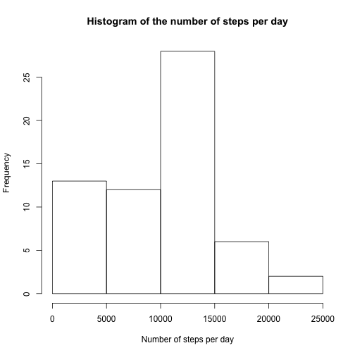
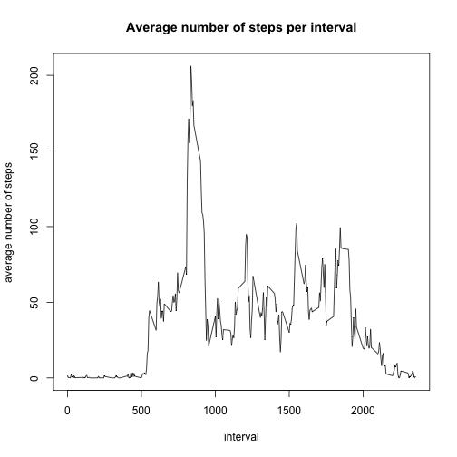
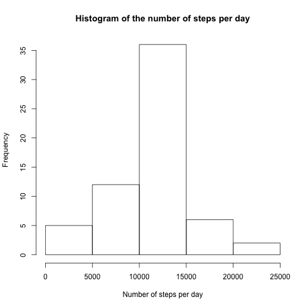

# Reproducible Research: Peer Assessment 1


## Loading and preprocessing the data

We assume that the zipped data file, "activity.zip", is located in the current working directory.  We first load the data and convert the dates in the file to the 'Date' class.  


```r
activity<-read.csv(unz("activity.zip", "activity.csv"))
activity$date<-as.Date(activity$date)
```


## What is mean total number of steps taken per day?

To compute the mean and median total number of steps taken each day, we start by taking the total number of steps for each day and creating a histogram.  

```r
total_steps<-aggregate(activity$steps, by=list(activity$date), FUN=sum, na.rm=TRUE)
colnames(total_steps)<-c("date", "steps")
hist(total_steps$steps, main="Histogram of the number of steps per day", xlab="Number of steps per day")
```

 


The mean of the total number of steps each day is:

```r
mean(total_steps$steps)
```

```
## [1] 9354
```

The median of the total number of steps each day is: 

```r
median(total_steps$steps)
```

```
## [1] 10395
```


## What is the average daily activity pattern?

We compute the average number of steps taken in each 5-minute interval and plot this information.  

```r
daily_avg<-aggregate(activity$steps, by=list(activity$interval), FUN=mean, na.rm=TRUE)
colnames(daily_avg)<-c("interval", "steps")
plot(daily_avg$interval, daily_avg$steps, type="l", xlab="interval", ylab="average number of steps", main="Average number of steps per interval")
```

 


The five minute interval containing the maximum average number of steps is: 

```r
max_steps<-max(daily_avg$steps)
daily_avg$interval[daily_avg$steps==max_steps]
```

```
## [1] 835
```

## Imputing missing values

The number of NAs is: 

```r
sum(is.na(activity$steps))
```

```
## [1] 2304
```

We will fill in an NA with the average value of steps taking in the corresponding 5 minute period.  

```r
missing<-is.na(activity$steps)
fill<-sapply(1:nrow(activity), function(x) ifelse(missing[x], daily_avg$steps[daily_avg$interval==activity$interval[x]], activity$steps[x]))
```

The data frame 'activity_new' is the same as 'activity' with the NAs filled in.  

```r
activity_new<-data.frame(fill, activity$date, activity$interval)
colnames(activity_new)<-c("steps", "date", "interval")
```

We re-compute the total number of steps for each day, using the updated data.    

```r
total_steps<-aggregate(activity_new$steps, by=list(activity_new$date), FUN=sum)
colnames(total_steps)<-c("date", "steps")
hist(total_steps$steps, main="Histogram of the number of steps per day", xlab="Number of steps per day")
```

 

The updated mean of the total number of steps each day is: 

```r
mean(total_steps$steps)
```

```
## [1] 10766
```

The updated median of the total number of steps each day is: 

```r
median(total_steps$steps)
```

```
## [1] 10766
```

These values are higher than the mean and median computed on the original data set because in the original data set days that have many NAs will skew the mean and median down.  

## Are there differences in activity patterns between weekdays and weekends?
We would like to determine differences in the activity patterns between days during the week and days during the weekend.  Below is a panel containing plots of the 5-minute intervals and the average number of steps taken across weekday days and weekend days.  

```r
library(lattice)
days<-weekdays(activity_new$date)
day_type<-ifelse(days=="Saturday" | days=="Sunday", "weekend", "weekday")
day_type<-as.factor(day_type)
activity_new<-data.frame(activity_new, day_type)
avg<-aggregate(activity_new$steps, by=list(activity_new$interval, activity_new$day_type), FUN=mean)
colnames(avg)<-c("interval", "day_type", "steps")
xyplot(steps~interval|day_type, data=avg, type="l", layout=c(1,2))
```

 


We observe that on weekdays the number of steps spikes in the morning hours and on weekend days the number of steps are more evenly spread throughout the day.  
